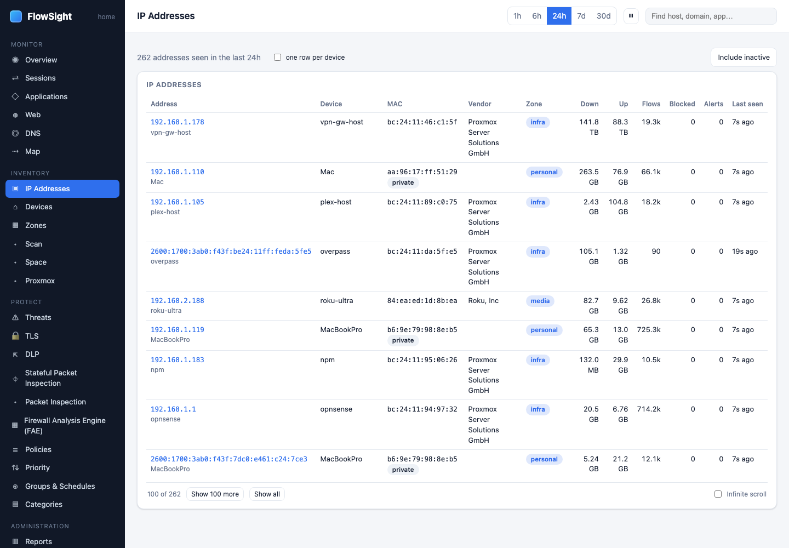
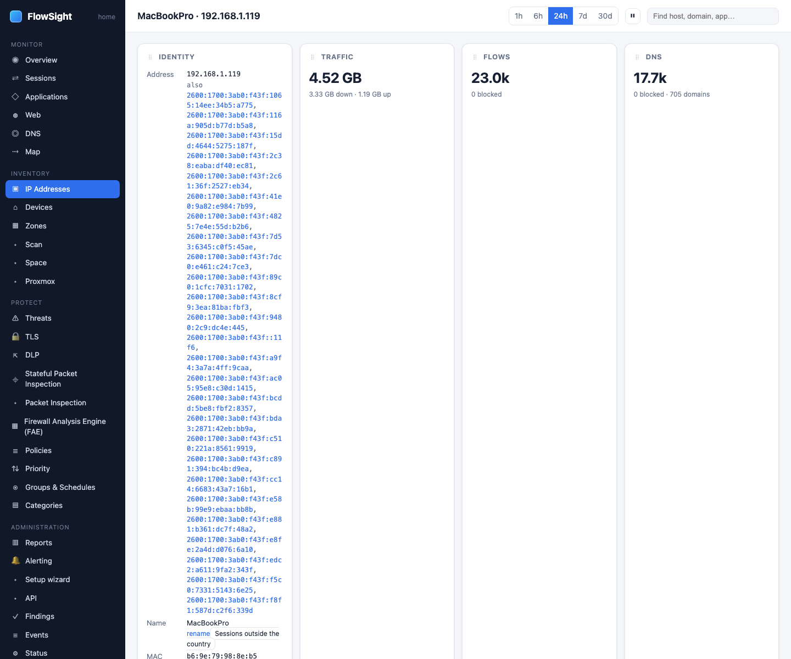

# HOWTO: see what one device is talking to

Find a device on your network and review all its traffic: what it connects to, what applications it runs, and when.

*IP Addresses: one row per address, or one per device with the box ticked; names carry their source.*

*A device page: sessions, applications, sites, DNS and the links to its sessions abroad and its baseline.*

## Prerequisites

- Traffic is being captured
- The device has sent traffic within the time window

## Steps

1. **Find the device.**
   Two options:
   
   **Option A: From the Devices page**
   - FlowSight › Devices (under INVENTORY)
   - Scroll through the list and find the device by name (e.g., "MacBookPro", "iPhone")
   - Click the device's row to open its host page
   
   **Option B: From the IP Addresses page**
   - FlowSight › IP Addresses (under INVENTORY)
   - Scroll or search for the device (by name or address)
   - Click its address to open the host page

2. **Read the host page.**
   The page shows everything about this device:
   - **Identity**: device name, IP address, MAC address, zone assignment (if any)
   - **Sessions**: all flows to/from this device
   - **Applications**: apps running on the device
   - **Sites**: domains and names it connects to
   - **DNS lookups**: every domain it has queried
   - **Ports**: which ports it uses (TCP/UDP)
   - **Countries**: which countries its servers are in (if enrichment is on)

3. **Review its traffic.**
   For each table:
   - Click a row to open that session, site, or application on its detail page
   - Click **Map** on a session to trace the route to that destination
   - Click **Block** to write a policy denying that traffic (if you trust the policy module)

4. **Filter by time window.**
   Use the range buttons at the top: 1h, 6h, 24h, 7d, 30d
   
5. **Check for unusual behavior.**
   - **Large uploads**: look for sessions with high outbound bytes
   - **Outbound DNS**: check DNS lookups for suspicious domains
   - **Non-standard ports**: check the Ports table for unexpected port numbers
   - **Many countries**: if the device contacts many countries, it may be a VPN or relay

6. **Understand the session details.**
   Each session shows:
   - **Client and server**: the local device and the far end (with country if enrichment is on)
   - **Application**: what nDPI recognized (or "Unknown")
   - **Site**: domain name from DNS or proxy
   - **Protocol and port**: TCP/UDP and the port number
   - **Bytes**: upload and download total
   - **Duration**: how long the session lasted
   - **Verdict**: allowed or blocked, and by which policy if blocked

## What to expect

- **Device names come from DHCP or mDNS**: if you set a DHCP reservation or the device announces its name, it will appear here
- **Addresses without names**: use the host page to assign them to a zone so they are easier to find later
- **Multiple IP addresses per device**: a device with WiFi and Ethernet may have two addresses; both appear on the Devices page
- **Sessions from cached DNS**: the DNS lookups on the device page may predate the sessions (the device looked up the name days ago)
- **Encrypted connections show only the port**: without TLS inspection or proxy interception, you see the destination and port but not the site

## Limits

- Only traffic that crossed the gateway is recorded (traffic between two local devices does not appear)
- DNS over HTTPS (DoH) and DNS over TLS bypass your resolver and are not logged
- IPv6 addresses are supported; use the address list to find IPv6-only devices
- The host page does not show traffic generated by the gateway itself

## Related

- [Identify an unknown device](identify-device.md)
- [See where a policy's traffic goes](policy-matches.md)
- [Block apps and categories on a schedule](policy-schedule.md)
- *User guide › IP Addresses*
- *User guide › Devices*
