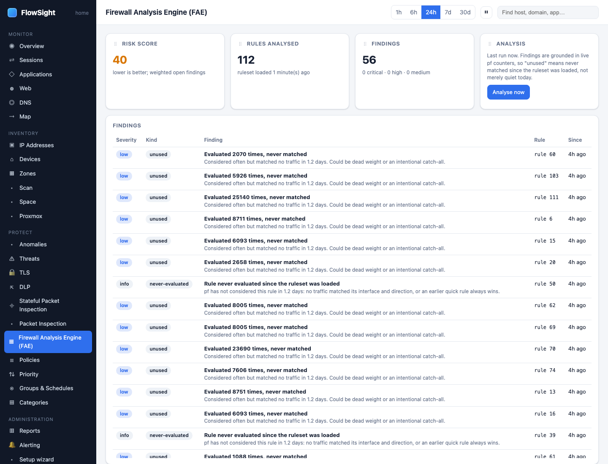

# HOWTO: understand blocked traffic with the Firewall Analysis Engine

Use the Firewall Analysis Engine (FAE) to diagnose why traffic was blocked, understand firewall rules, and validate policies.

*Firewall Analysis Engine: findings, the risk score, and rules with live counters.*

## Prerequisites

- A policy with country, domain, category, or application rules is active
- The policy is in *block* mode (or *monitor* mode works too)
- Blocked traffic exists in the time window

## Steps

1. **Open the Firewall Analysis Engine.**
   - FlowSight › Firewall Analysis Engine (FAE) (under PROTECT)
   - Or: from a policy page, click **Firewall Analysis Engine**

2. **Understand the three views.**
   The FAE page shows:
   - **Blocked by policy**: sessions denied by your policies
   - **Firewall rules and tables**: the actual pf rules compiled from your policies
   - **Blocked packets** (Firewall log): pf's own record of matched packets

3. **Read "Blocked by policy" view.**
   This shows sessions from the session table that match a blocked policy:
   - **Device**: which local device attempted the traffic
   - **Destination**: the far end (address, domain, country)
   - **Application**: what nDPI identified
   - **Policy**: which policy blocked it
   - **When**: the time of the attempt
   - **Sessions**: how many times
   - **Bytes**: how much data was attempted

   Click a row to expand and see:
   - The session details (ports, protocol)
   - The policy's rule (which field blocked it: country, domain, category, app)
   - Whether it is still being blocked or was allowed later

4. **Understand the "Firewall rules and tables" card.**
   This shows the compiled pf rules and their live counters:
   - **Table name**: `country_us`, `domain_ads`, `category_streaming`, etc.
   - **Prefixes built**: how many IP ranges (for country rules) or domains (for domain lists)
   - **In kernel**: how many the kernel currently holds (may be fewer due to memory limits)
   - **Rule**: the pf rule that uses this table
   - **Packets**: live match counter (how many packets the rule has seen)
   - **Last match**: when the rule last matched

   The **Test table membership** box lets you check whether a specific IP is in a table:
   - Type an IP: `8.8.8.8`
   - Click **Test**
   - See which tables it is in (e.g., "In table: country_us")

5. **Check the firewall log view.**
   Under **Blocked packets (firewall log)**:
   - Every packet the pf rule matched is logged here
   - Each row shows:
     - **Device**: source IP (the one trying to break the rule)
     - **Destination**: where it tried to go
     - **Port**: TCP or UDP port
     - **Packets**: count of packets in this session
     - **Rule**: which rule blocked it
   - This is the ground truth: if a packet is not here, the firewall did not see it

6. **Diagnose a blocked device.**
   If a device should be allowed but is blocked:
   1. Find its row in the "Blocked by policy" view
   2. Click it to see which rule blocked it
   3. Check the policy (Policies page) to see if it's intentional
   4. Edit the policy to add an exception (exclusions list) or disable it
   5. The block should clear within 30 seconds

7. **Check if a table is full.**
   Large country tables can hit memory limits:
   - The **In kernel** count is less than **Prefixes built**
   - Example: `1.07 million built, 980k in kernel` = 70k prefixes are missing due to memory
   - Workaround: reduce the number of countries in the policy, or add more RAM to the gateway

## What to expect

- **Firewall log lags 5–10 seconds** behind live traffic
- **Table membership test is instant**: uses kernel data
- **Packets, not sessions**: the log shows packets, not HTTP flows (one session = many packets)
- **Multiple rules may match**: a packet can be logged by multiple rules if they overlap
- **Anycast is excluded**: for country tables, anycast addresses are left out; they do not appear in the "In kernel" count

## Limits

- **Memory constraints**: large country tables (>1M prefixes) are truncated to fit in kernel memory
- **Accuracy**: the table test shows membership at this moment; it changes as tables are updated (monthly)
- **Encryption**: blocked encrypted traffic shows only destination and port, not the domain
- **IPv4 and IPv6**: tables hold both; the test works for both

## Troubleshooting

**A destination is not blocked even though it should be:**
1. Check the Firewall Analysis Engine: is the rule present?
2. Check the rule's match counter: is it increasing?
3. If yes: the firewall is working; the traffic may not actually match (e.g., wrong address family)
4. If no: the rule was not compiled; check the policy for errors (the plan shows warnings)

**A rule is present but has zero packets:**
1. The destination may not be active in this window
2. The policy may have been added after the traffic
3. Try blocking a different destination to verify the rule works

**A table is full (memory limit):**
1. The firewall is working, but some prefixes are missing
2. Reduce the policy scope: fewer countries, fewer domains
3. Or: upgrade the gateway's RAM

## Related

- [See where a policy's traffic goes](policy-matches.md)
- [Block apps and categories on a schedule](policy-schedule.md)
- [See what your IoT devices send abroad, and block it](iot-abroad.md)
- *User guide › Firewall Analysis Engine*
