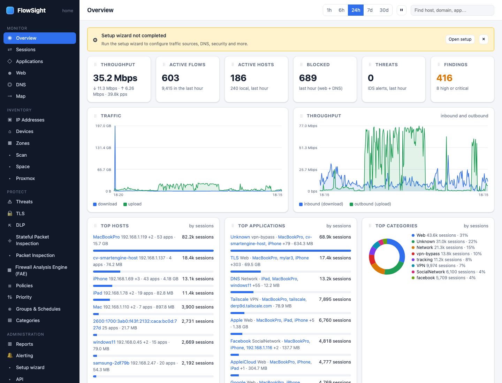

# HOWTO: find the first hour of activity

The Overview page is your network at a glance. Read the cards, set the time window, and understand the key metrics.

*The Overview: throughput, active flows and hosts, blocked and threats, then top hosts, applications and categories for the chosen window.*

## Prerequisites

- FlowSight is capturing traffic (at least 10 minutes of history)
- Sources are enabled in *Administration › Settings › sources*

## Steps

1. **Open the Overview.**
   - FlowSight › Overview (under the MONITOR section of the left menu)

2. **Set the time window.**
   - Click one of the range buttons at the top: **1h**, **6h**, **24h**, **7d**, **30d**
   - Start with **1h** (the last hour) if you just installed FlowSight
   - Every page on FlowSight respects this choice

3. **Read the headline metrics.**
   The top row shows six cards:
   - **Throughput**: total bytes inbound and outbound
   - **Active flows**: sessions in the window (one per client-server pair)
   - **Active hosts**: how many devices sent or received traffic
   - **Blocked**: requests blocked by policies (zero if no policies are enabled)
   - **Threats**: IDS/IPS alerts from intrusion detection
   - **Findings**: automated alerts (high-risk behavior, scanning, etc.)

4. **Understand the traffic chart.**
   - *Throughput* shows inbound (blue) and outbound (green) traffic over time
   - A spike means a large download or upload at that moment
   - Click a spike to focus on that time window (on desktop)

5. **Find active hosts and applications.**
   - **Top hosts** (by sessions): which devices are busiest
   - **Top applications**: what apps are running (VPN, streaming, updates)
   - Click any host or app to drill into its sessions on the Sessions page

6. **Check for blocked requests.**
   - **Top categories** shows web content (News, Streaming, Social Media)
   - If a category is missing, the rest are being allowed
   - A site in the list means at least one session touched that category
   - Click to see which sessions

7. **Watch for findings and threats.**
   - **Findings** (orange number) are automated alerts: scanning, evasion, DGA domains
   - **Threats** are IDS alerts (if intrusion detection is enabled)
   - Click the number to see the list

## What to expect

- **DNS traffic appears first**: every domain lookup is logged immediately
- **Applications take 5–10 minutes to appear**: nDPI needs to see enough traffic to recognize patterns
- **Device names come from DHCP or mDNS**: unknown devices appear as addresses (192.168.x.x in your network)
- **Traffic is live every 10–60 seconds**: the page auto-refreshes
- **Pause button** (⏸) stops auto-refresh; useful while you investigate

## Limits

- The dashboard shows the window you selected; older data is not discarded
- Very new applications may not be recognized (nDPI's catalogue is finite)
- Encrypted traffic (HTTPS without interception) shows only the destination and port, not the site
- Traffic between two local devices does not appear (it does not cross the gateway)

## Related

- [Set up sources and interception](getting-started.md)
- [See what one device is talking to](device-traffic.md)
- *User guide › Overview*
