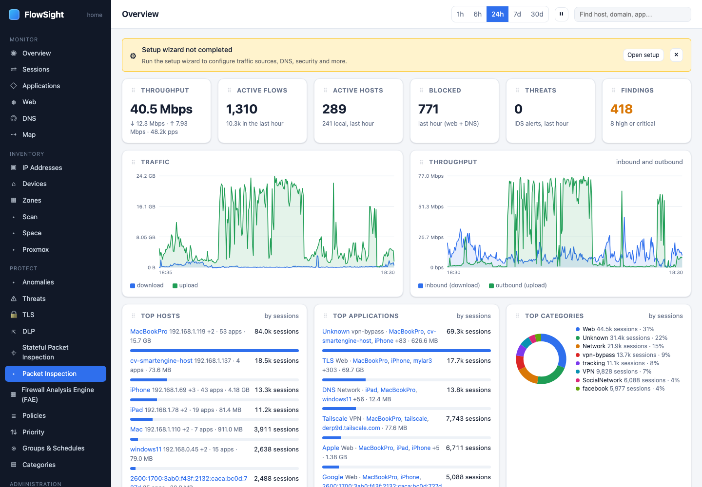

# HOWTO: capture and inspect packets

Use Packet Inspection to capture network traffic from a device, view live sessions, and download a pcap file for deeper analysis.

*Packet Inspection: the capture ring, live sessions and the pcap download.*

## Prerequisites

- FlowSight is capturing traffic
- You have identified a device to inspect
- (Optional: Wireshark or tcpdump for pcap analysis)

## Steps

1. **Open Packet Inspection.**
   - FlowSight › Packet Inspection (under PROTECT › Stateful Packet Inspection)
   - Or: go to a device's host page and look for a **Packet Inspection** button or link

2. **Start a capture.**
   
   **Option A: Capture from a device**
   - Click **New capture**
   - Set **Device** to the target (by address or name)
   - Set **Duration** (default 60 seconds; max 5 minutes)
   - Set **BPF filter** (optional):
     - `tcp port 443` — only HTTPS
     - `host 192.168.1.100` — only this device
     - `port 53` — only DNS
   - Click **Start**

   **Option B: Capture to an interface**
   - Click **New capture**
   - Set **Interface** to LAN or WAN
   - Set **BPF filter** to narrow the scope
   - Click **Start**

3. **Watch the capture in real time.**
   While the capture runs:
   - **Sessions** table shows active flows:
     - Source and destination
     - Protocol and port
     - Bytes sent and received
     - TLS info: version, SNI, certificate name
     - DNS info: query name and response
   - The page updates every 1–2 seconds
   - **Packets** shows raw packets if enabled

4. **Understand the session details.**
   Each row shows:
   - **Source**: client address and port
   - **Destination**: server address and port
   - **Protocol**: TCP/UDP/ICMP
   - **Bytes**: upload and download
   - **TLS**: TLS version and SNI (if encrypted)
   - **DNS**: name and response (if DNS query)
   - **Info**: protocol details if recognized

5. **Stop the capture.**
   - Click **Stop** when you have enough data
   - Or wait for the duration to expire

6. **Download the pcap file.**
   - After the capture completes, a **Download pcap** button appears
   - Click it to get the raw packet capture file
   - Open it with Wireshark or tcpdump for detailed analysis

7. **Analyze packets in Wireshark.**
   With the pcap file:
   - Open in Wireshark
   - Use filters like:
     - `dns` — DNS queries
     - `ssl.handshake.type == 1` — TLS handshakes
     - `http` — HTTP traffic (if captured unencrypted)
     - `tcp.stream == 0` — follow one TCP stream
   - Right-click › Follow Stream to see the conversation

## What to expect

- **Capture starts after a brief delay**: the buffer fills, then traffic appears
- **TLS SNI is visible**: even without inspection, the SNI field in the TLS handshake shows the domain
- **DNS queries are human-readable**: the capture shows the domain names
- **Large captures take time**: a 5-minute capture on a busy network may be 100+ MB
- **Encryption hides details**: encrypted payloads are visible as binary data; only metadata (IPs, ports, TLS SNI) is readable

## Limits

- **Duration limit**: captures are limited to 5 minutes to avoid filling the disk
- **Buffer size**: the capture buffer holds around 100 MB; very busy networks may lose packets
- **Accuracy**: packet timestamps are kernel-level; they are accurate to microseconds
- **Interface capture**: capturing on WAN may impact performance
- **Encrypted payloads**: without TLS inspection, only the TLS handshake is visible, not the request/response

## Related

- [Enable TLS inspection for one device](tls-inspect-device.md)
- [See what one device is talking to](device-traffic.md)
- *User guide › Packet Inspection*
