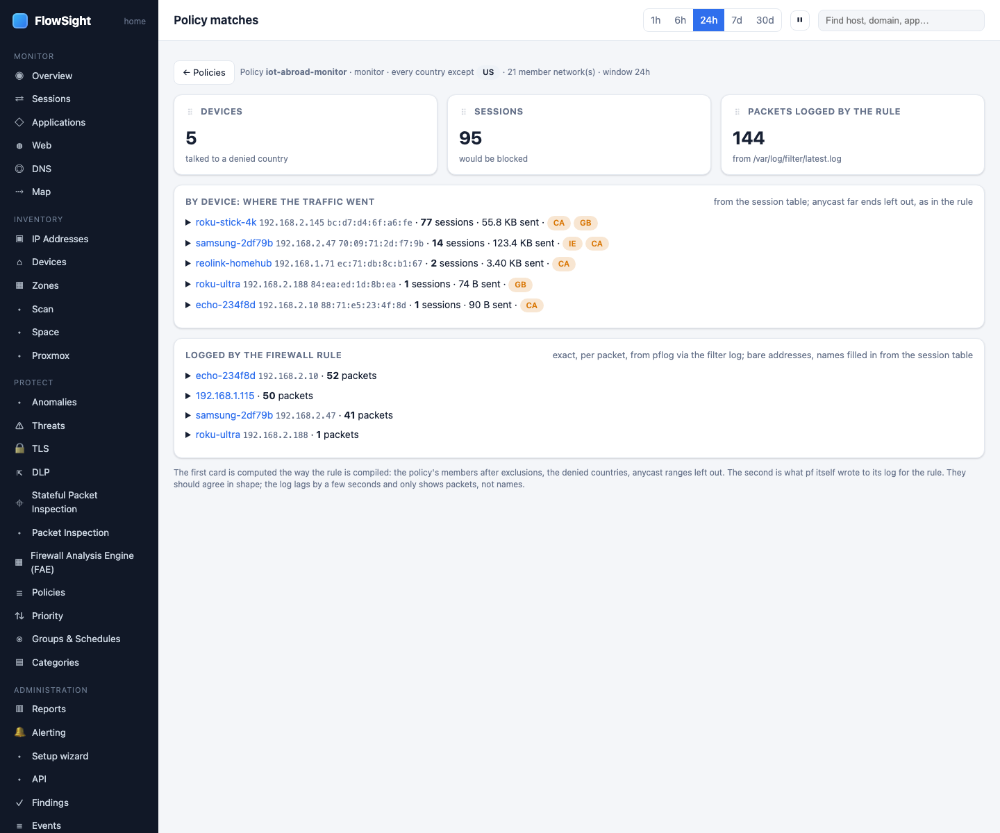

# HOWTO: see where a policy's traffic goes

After you create a policy, open the Matches page to see which sessions and firewall packets it matched, and understand what it is actually doing.

*Policy matches: what the rule catches per device from the session table, and beside it what pf logged for the rule.*

## Prerequisites

- You have created at least one policy with a country rule, domain list, category, or application filter
- The policy is in *monitor* or *block* mode
- Matching traffic exists in the time window

## Steps

1. **Create or find a policy.**
   - FlowSight › Policies (under PROTECT)
   - Click **New policy** to create one, or click an existing policy

2. **If creating a new policy:**
   - Set **Members**: who this applies to (e.g., `zone:iot` or a device MAC)
   - Set the **rule**: what to deny (countries, domains, categories, apps)
   - Set **Action**: choose *monitor* first to see matches without blocking
   - Click **Save**

3. **Open the Matches page.**
   - On the Policies page, find your policy's row
   - Click **Matches** at the right side
   - (The button only appears if the policy has a country, domain, or category rule)

4. **Read the "By device" view.**
   - The first card shows **By device: where the traffic went**
   - Each row is one device from your policy's member list:
     - **Device**: name and address
     - **Sessions**: how many matched in the window
     - **Bytes**: how much data was sent/received
     - **Countries**: which countries (for country policies)
   - Click a device to expand it and see the destinations behind it:
     - **Domain or address**: the far end
     - **Country**: where it is registered (if enrichment is on)
     - **Port**: which port
     - **Application**: what nDPI recognized
     - **Sessions and bytes**: count and data
     - **Last seen**: when it last matched
     - **Map**: click to see the route to that destination

5. **Read the "Logged by the firewall rule" view.**
   - The second card shows **Logged by the firewall rule**
   - This is pf's own record: every *packet* the rule matched, not sessions
   - Each row is:
     - **Device**: the source
     - **Destination**: address and country
     - **Port and protocol**: TCP/UDP and port
     - **Packets**: how many the rule saw
   - This is the ground truth for what the rule caught (it lags 5–10 seconds behind live traffic)

6. **Switch from monitor to block (when ready).**
   - If the Matches page shows the right traffic, go back to Policies
   - Click the policy to edit it
   - Change **Action** from *monitor* to *block*
   - Click **Save**
   - The Matches page will now show blocked traffic

## What to expect

- **Monitor mode vs. block mode**: both views describe the same traffic; in monitor mode it would be blocked, in block mode it is being blocked
- **Firewall packets lag 5–10 seconds** behind live sessions
- **The "By device" view is computed** from the session table, not the firewall log
- **The "Logged" view is definitive**: if a packet is not here, the firewall rule did not see it
- **Anycast sessions**: for country policies, anycast destinations (marked *anycast*) are left out of the country table, so they do not appear here even if the session is visible elsewhere

## Limits

- The Matches button only appears for policies with country, domain, or category rules
- Application-based policies do not have firewall rules and do not appear here
- IPv6 and IPv4 matches are both logged together
- The page shows data from the last 7 days of matched packets

## Related

- [See what your IoT devices send abroad, and block it](iot-abroad.md)
- [Block apps and categories on a schedule](policy-schedule.md)
- *User guide › Policies*
- *User guide › Policy matches page*
