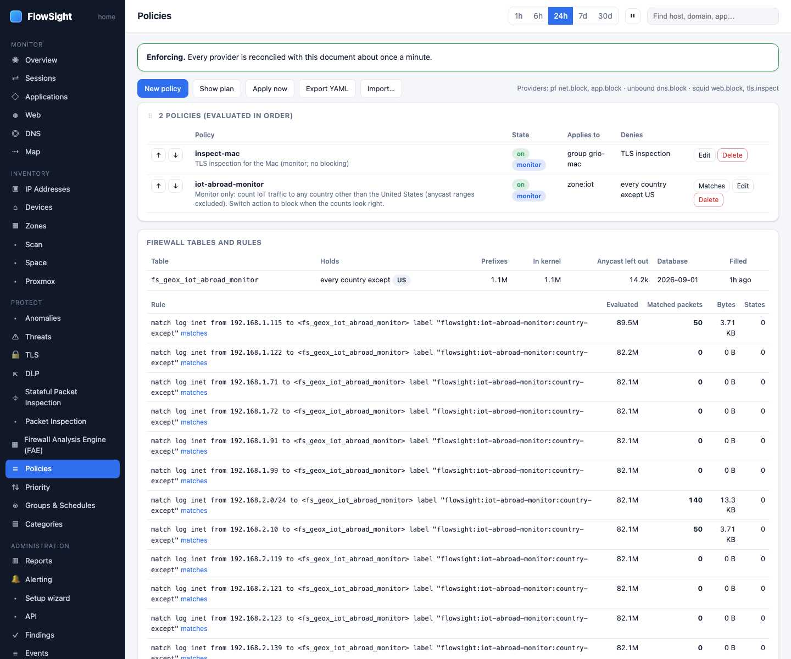
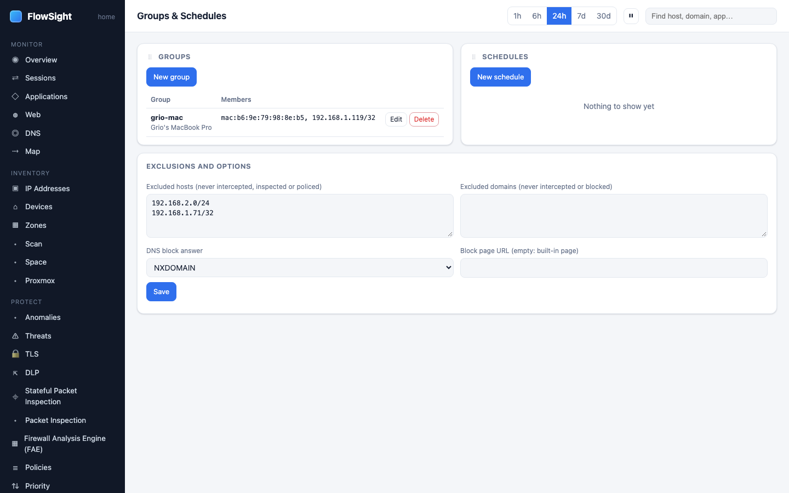

# HOWTO: block apps and categories on a schedule

Create a time-based policy that blocks specific applications or web categories for a group of devices on a recurring schedule.

*Policies in evaluation order, with the Firewall tables and rules card at the foot.*

*Groups and schedules: who a policy applies to and when.*

## Prerequisites

- You have identified the devices or zone to protect
- You know which apps or categories to block
- You have created time-based schedules (optional, required for time-based rules)

## Steps

1. **Create a time-based schedule (optional but recommended).**
   - FlowSight › Groups & Schedules (under PROTECT)
   - Click **New schedule**
   - Name it: `bedtime`, `work-hours`, `homework-time`, etc.
   - Set the **recurrence**:
     - Days of week: select which days apply
     - Time: start and end time
     - Timezone: your local zone
   - Click **Save**
   - Example: *bedtime* (daily, 9pm–7am)

2. **Create a group for the devices.**
   - FlowSight › Groups & Schedules
   - Click **New group**
   - Name it: `kids-devices`, `guest-wifi`, `managed-staff`, etc.
   - Add **members**:
     - By zone: `zone:kids`
     - By MAC: `mac:aa:bb:cc:dd:ee:ff` (most stable)
     - By address: `192.168.1.50` (changes with DHCP)
   - Click **Save**

3. **Create the policy.**
   - FlowSight › Policies (under PROTECT)
   - Click **New policy**
   - Name it: `bedtime-web-block`, `work-day-news-block`, etc.

4. **Set the members.**
   - In the **Who** tab, add the group you created:
     - Type `group:kids-devices` (or choose it from the dropdown)
     - Or pick devices directly by MAC or zone

5. **Choose what to block.**
   You can block by:
   - **Applications**: click the *Applications* tab, pick apps to deny (YouTube, TikTok, Discord, etc.)
   - **Categories**: click the *Categories* tab, pick categories (Gaming, News, Streaming, etc.)
   - **Domains**: click the *Domains* tab, add domain names or lists
   - **Countries**: click the *Countries* tab (for geo-blocking)

6. **Set the schedule (if time-based).**
   - In the policy editor, find the **Schedule** or **Time** section
   - Pick the schedule you created (e.g., *bedtime*)
   - Leave empty for always-on

7. **Choose the action.**
   - **monitor**: log what would be blocked, do not actually block (recommended first)
   - **block**: enforce the policy immediately

8. **Review and save.**
   - The plan preview shows what the policy compiles to
   - Check for warnings (e.g., members in the exclusions list)
   - Click **Save**

9. **Verify it is working.**
   - Go to FlowSight › Sessions
   - Filter by the group or device
   - If set to *monitor*, you will see sessions marked *blocked (policy name)*
   - Once verified, edit the policy and change to *block*

## What to expect

- **Monitor mode takes 5–15 minutes to show data**: sessions need to accumulate
- **Time-based rules**: switch to *block* during the schedule window, then revert after
- **Device additions**: if you add a new device to the group, it is immediately covered by the policy
- **Encrypted traffic**: apps inside HTTPS (TikTok, YouTube) need TLS inspection to be identified; without it, they show as "Unknown"
- **The plan may show warnings**: if the group's subnet is in the exclusions list, the policy may not apply to those members

## Limits

- **Applications**: nDPI's catalogue is finite; new apps may not be recognized immediately
- **Time-based**: the schedule is checked at the gateway; client clock mismatches do not matter
- **Exceptions**: you cannot exclude specific devices from a group-based policy (only entire groups)
- **IPv6**: policies apply to both IPv4 and IPv6
- **Domains**: blocking a domain does not block its IP address if the device caches the lookup

## Related

- [See what one device is talking to](device-traffic.md)
- [Block apps and categories on a schedule](policy-schedule.md)
- [See where a policy's traffic goes](policy-matches.md)
- *User guide › Policies*
- *User guide › Groups & Schedules*
