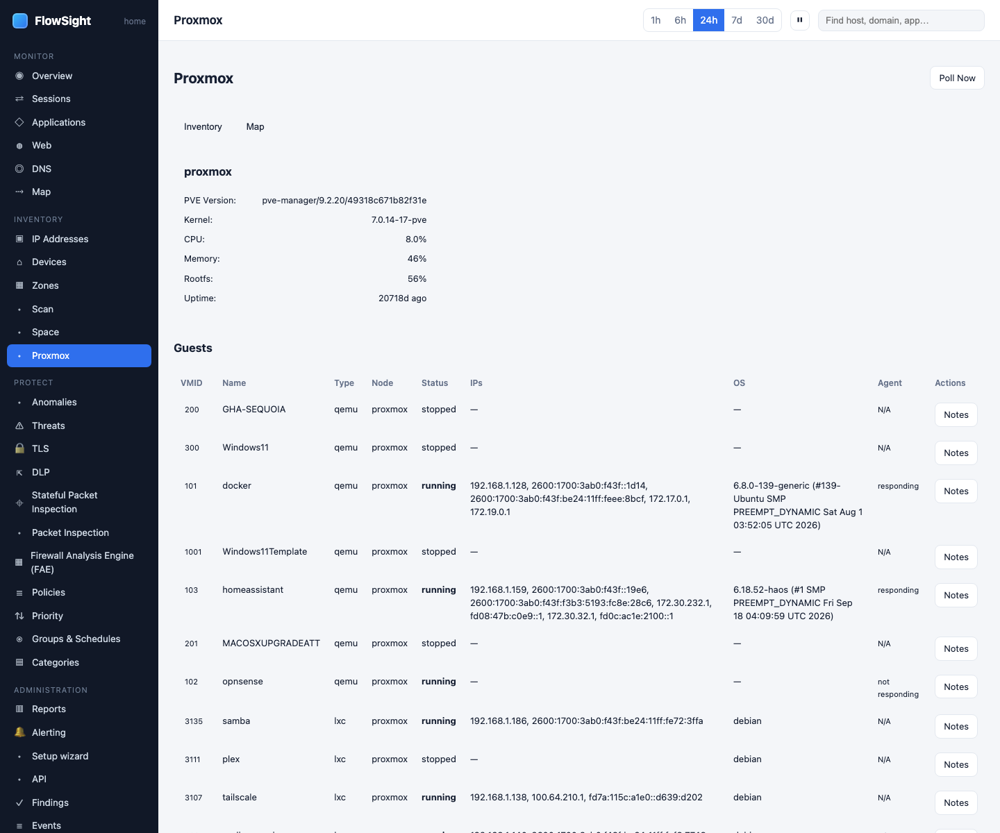

# HOWTO: map your Proxmox guests

Inventory your Proxmox VMs and containers in FlowSight, view the dependency map, and add notes about each guest.

**Tier**: Pro

*Proxmox: guests, facts from the guest agent and the dependency map.*

## Prerequisites

- A Proxmox cluster or standalone Proxmox node
- FlowSight is installed on the gateway
- You have a Proxmox API token with VM.Monitor permission (minimum)

## Steps

1. **Create a Proxmox API token.**
   On your Proxmox host:
   - Datacenter › Permissions › API Tokens
   - Click **Add**
   - Name: `flowsight`
   - Realm: `Proxmox` (built-in)
   - Do NOT check "Disable expiration"
   - Copy the token ID and secret (you will need both)

2. **Configure FlowSight to connect to Proxmox.**
   - FlowSight › Settings (under ADMINISTRATION)
   - Find *Proxmox* or click **Add module**
   - Set:
     - **Host**: your Proxmox address (e.g., `proxmox.example.com` or `192.168.1.100`)
     - **Port**: 8006 (default)
     - **API token ID**: (from step 1)
     - **API token secret**: (from step 1)
     - **Verify SSL**: check if you trust the certificate
   - Click **Test** to verify the connection
   - Click **Save**

3. **Open the Proxmox page.**
   - FlowSight › Proxmox (under INVENTORY)
   - The page loads the VM and container list from Proxmox
   - Each guest shows:
     - **Name**: VM or container name
     - **Type**: virtual machine or container
     - **Node**: which Proxmox host it runs on
     - **Status**: running or stopped
     - **CPU**: cores assigned
     - **Memory**: RAM assigned
     - **Disk**: storage allocated
     - **IP address**: if FlowSight can determine it
     - **Network activity**: traffic observed from this guest

4. **View the dependency map.**
   - From the Proxmox page, click **Map** or **Dependency graph**
   - The map shows:
     - Your Proxmox nodes (physical hosts)
     - VMs and containers running on each
     - Network connections between guests
     - Your gateway
   - Hover over a guest to see its details

5. **Add notes to a guest (Business tier).**
   - Click a guest's row or name
   - Open the guest details
   - Find **Notes** or a **Description** field
   - Add text: `Kubernetes node`, `Development VM`, `Database server`, etc.
   - Click **Save**
   - Notes sync back to the guest's description in Proxmox (on Business tier)

6. **Monitor guest traffic.**
   - Each guest's row shows:
     - **Sessions**: flows to/from the guest
     - **Throughput**: current traffic
     - **Applications**: what it is running
   - Click the guest to see its full host page on the IP Addresses view

## What to expect

- **Initial sync takes 10–30 seconds** to fetch the guest list
- **IP addresses**: FlowSight learns IPs from DHCP leases, reverse DNS, and traffic observations
- **Offline guests**: stopped or paused VMs appear but show no traffic
- **Credentials stored securely**: the API token is encrypted in the FlowSight database
- **Read-only**: FlowSight does not modify Proxmox; VM.Monitor permission is sufficient

## Limits

- **Proxmox 6.0+**: older versions may not have API token support
- **Network visibility**: FlowSight only sees traffic that crosses the gateway; inter-guest traffic on the same node may be invisible
- **IPv6**: if your guests use only IPv6, they appear on the Proxmox page but may not correlate with FlowSight's sessions
- **Note sync**: notes only sync when you have Business tier (Pro tier is read-only)

## Related

- [Identify an unknown device](identify-device.md)
- [Place devices in your physical space](device-location.md)
- *User guide › Proxmox*
