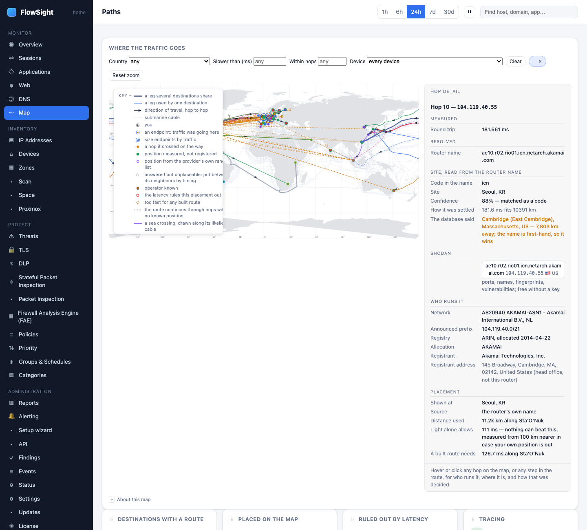

# HOWTO: trace a destination on the Map

Find where a server or application really lives using the Map page: see the route from your gateway to its location, understand anycast, and check latency.

*The Map with a route chosen: the trail below the map, hop by hop, with anycast and plausibility explained.*

## Prerequisites

- Traffic is being captured
- You have a destination you want to locate (a website, app, or IP address)

## Steps

1. **Find a destination.**
   Several entry points:
   
   **Option A: From the Overview**
   - FlowSight › Overview
   - In the *Top sites* section, click **map** on any site to see its route
   
   **Option B: From Sessions**
   - FlowSight › Sessions
   - Click **Map** at the end of any session row
   
   **Option C: From a host page**
   - FlowSight › Devices, find a device, click it
   - In the *Sites* table, click **map** next to a site
   
   **Option D: Direct search**
   - FlowSight › Map
   - Use the search box at the top to enter a domain name or address

2. **Read the Map page.**
   The page shows:
   - **Your gateway** (left): your public IP and the country you are in
   - **The destination** (right): the server's address and country
   - **The route**: hops between them (the path packets take across the internet)
   - **Latency**: round-trip time to each hop and the destination
   - **Anycast indicator**: if the destination is anycast (served from many locations)

3. **Understand the route.**
   Each hop shows:
   - **Number**: the hop number (1 is your ISP's router, usually)
   - **IP address**: the router's address
   - **Hostname**: the reverse DNS name (if available)
   - **Latency**: milliseconds to reach it
   - **Network**: the owner (ISP name, datacenter, CDN)
   - **Country**: where it is physically located
   - **Last hop**: the destination, which actually answered

4. **Filter by device (if multiple devices use this destination).**
   - The **Device** filter shows which of your devices reached this destination
   - If multiple devices use it, the filter shows: *N devices*
   - Click the filter to narrow to one device's sessions to this destination

5. **Check for anycast.**
   - An **anycast** label means the address is served from many locations at once (CDNs like Akamai, CloudFlare; root DNS servers)
   - The Map shows the closest location that answered
   - Anycast destinations are typically safe to allow in country policies

6. **Look at the latency trend.**
   - If latency suddenly increases mid-route, a hop may be far away or overloaded
   - The destination latency (right side) should match typical expected times:
     - Same country: 5–50 ms
     - Nearby region: 50–150 ms
     - Overseas: 100–300 ms
     - Very high (>500 ms): unusual, may indicate routing issues

7. **Check the route visualizer (optional).**
   - On some routes, a visual cable diagram shows the path
   - Cities and cable routes are from public internet infrastructure databases
   - They may not be exact, but give a rough sense of the path

## What to expect

- **Not all hops respond**: some routers do not answer traceroute probes; these appear as *no response*
- **The route can vary**: packets may take different paths on different attempts (load balancing, redundancy)
- **TTL exceeded**: if the route probe exceeds the maximum hops (usually 30–64), the trace stops early
- **Anycast addresses are everywhere**: any address that is not anycast but still on multiple continents is probably a CDN
- **The Map caches routes**: once traced, a route is shown again without re-probing for up to 7 days

## Limits

- Some ISPs and networks block traceroute probes; the route may be incomplete
- The map shows only IP-level hops, not BGP routing or fiber paths
- Country assignment is by IP registration, not physical location
- Some servers (especially cloud providers) may be registered in one country but hosted in another

## Related

- [See what your IoT devices send abroad, and block it](iot-abroad.md)
- [See where a policy's traffic goes](policy-matches.md)
- *User guide › Map*
